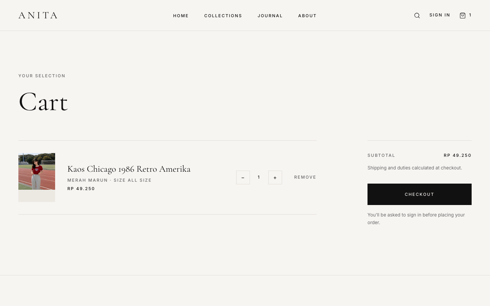
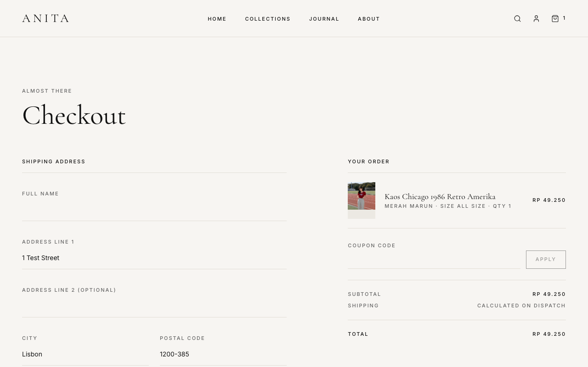
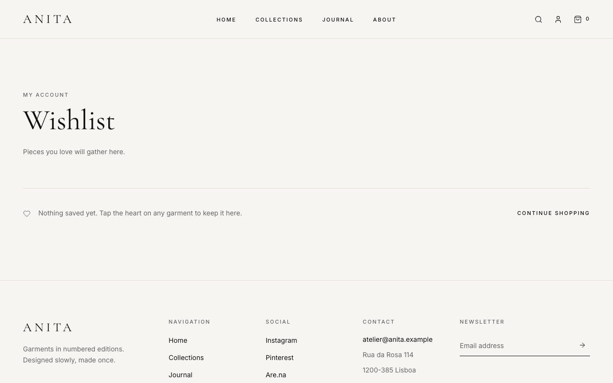
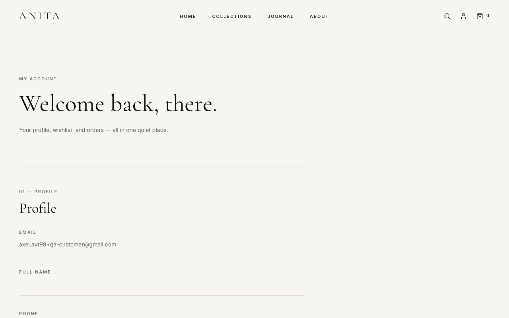
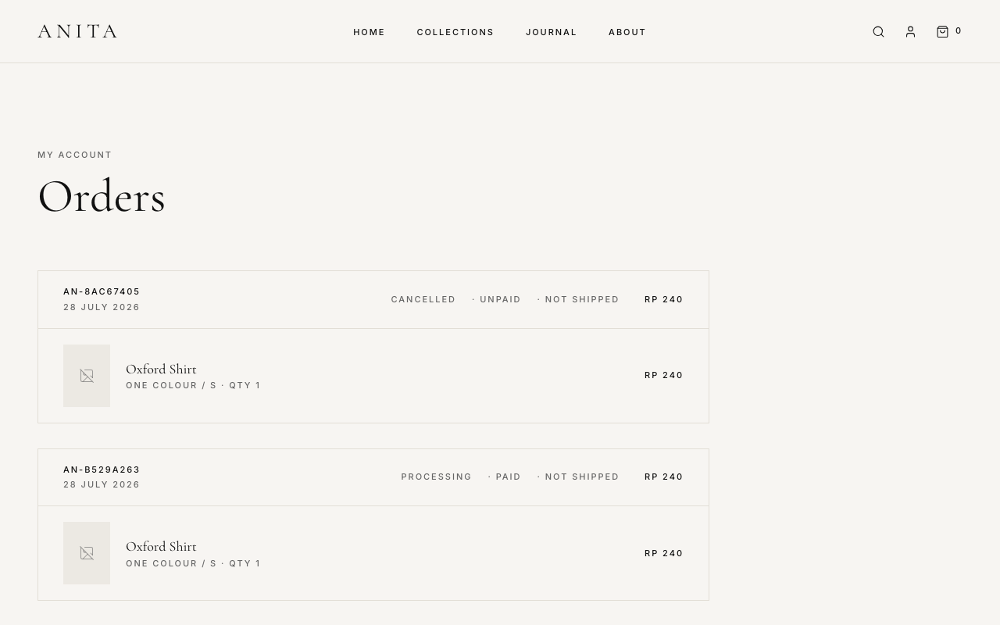
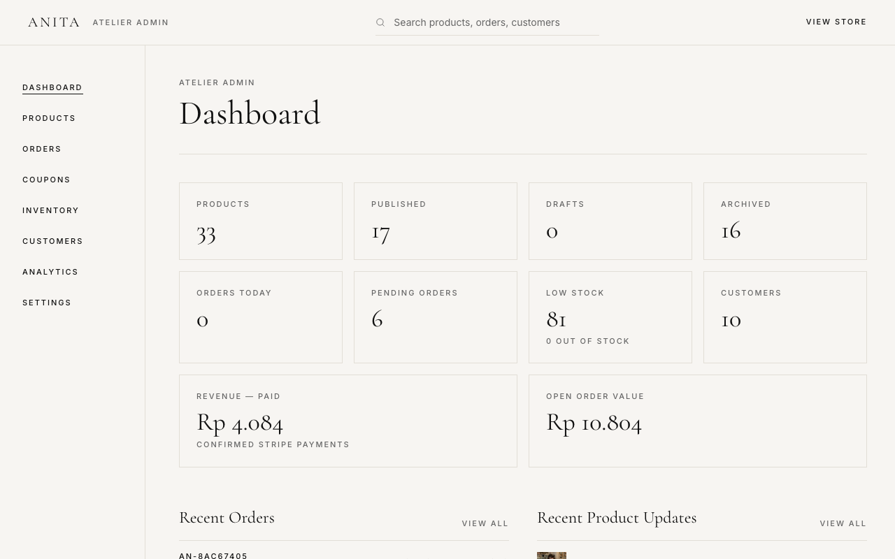
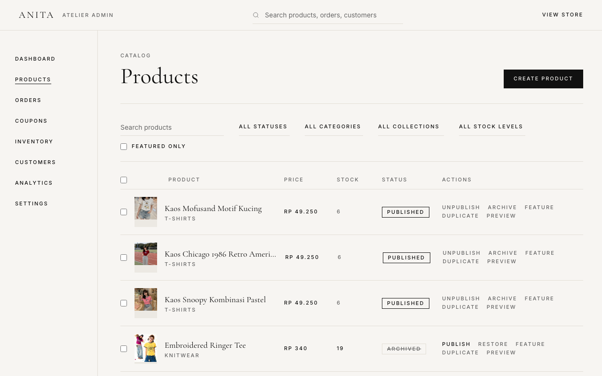
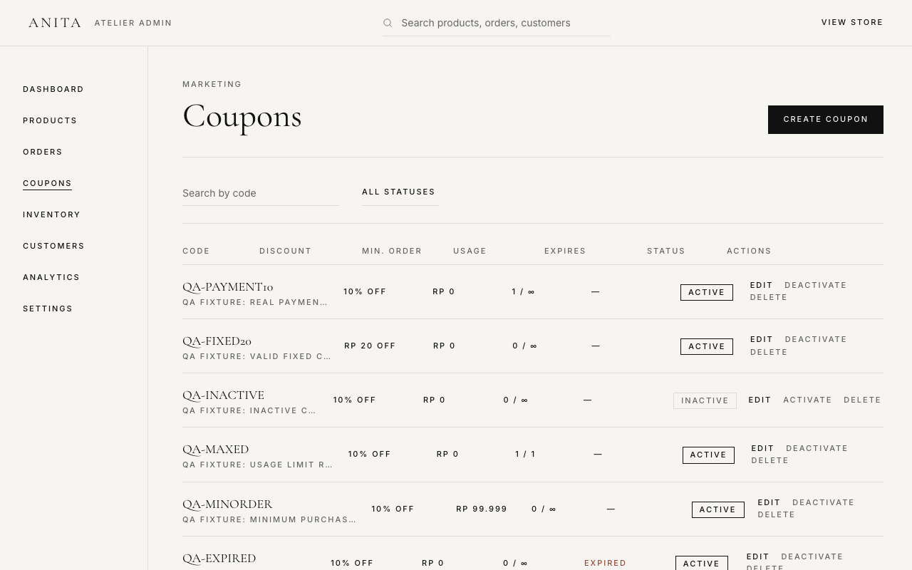

<div align="center">

# ANITA — Numbered Editions

**A full-stack luxury e-commerce platform** — editorial storefront, real payments, coupons, inventory, and an admin back office, built solo and shipped to production.

[](https://panda-collection.vercel.app)
[](https://react.dev)
[](https://www.typescriptlang.org)
[](https://supabase.com)
[](https://stripe.com)
[](./tests)
[](./LICENSE)

[Live Demo](https://panda-collection.vercel.app) · [Project Showcase](./PROJECT_SHOWCASE.md) · [Documentation](./docs) · [Deployment Guide](./DEPLOYMENT.md)

</div>

---

## Overview

ANITA is a fictional luxury clothing atelier that releases garments in numbered editions of twenty — a portfolio project built to demonstrate production-grade full-stack engineering, not a toy demo. Every feature a real storefront needs is implemented against a real backend: authentication, a synced wishlist and cart, real Stripe Checkout payments (test mode), a server-validated coupon engine, inventory that actually decrements on purchase, and a complete admin dashboard for managing all of it.

It's deployed and live at **[panda-collection.vercel.app](https://panda-collection.vercel.app)**, backed by a real Supabase project, verified end-to-end with a 157-test Playwright suite that runs against the live deployment — not mocks.

## Why this project exists

Most portfolio e-commerce clones stop at "products in a grid with a fake cart." The interesting engineering in a real store is everywhere else: making sure a discount computed in the browser can never be the discount that's actually charged, making sure two people can't buy the last unit of something at the same second, making sure a webhook that fires twice doesn't fulfill an order twice, making sure signing out on one device doesn't silently sign you out on another. This project was built to work through those problems for real, on a real payment rail, and prove it with tests that hit the live site — not to ship another static catalog.

## Key Features

| Area | What it does |
|---|---|
| 🛍️ **Storefront** | Editorial homepage, filterable/searchable/sortable collection grid, product detail pages, responsive across mobile/tablet/desktop |
| 🔐 **Authentication** | Email/password sign-up & sign-in, password reset, "remember me" with correct per-device session scoping, protected routes |
| ❤️ **Wishlist** | Server-synced (not `localStorage`) — persists across devices, kept in sync between the product page and the wishlist page |
| 🛒 **Cart & Checkout** | Persistent cart, live order summary, shipping address capture, redirect to Stripe's hosted Checkout |
| 💳 **Payments (Stripe, Test Mode)** | Real Checkout Sessions created server-side, webhook-verified payment confirmation, inventory decrement, cart clearing — all server-authoritative |
| 🏷️ **Coupons** | Percentage & fixed-amount discounts, usage limits, expiry windows, minimum-order thresholds — validated and re-priced server-side, never trusting the client |
| 📦 **Inventory** | Per-variant (size/color) stock tracking, out-of-stock prevention, low-stock indicators, atomic decrement-on-payment |
| 🧑‍💼 **Admin Dashboard** | Product CRUD with image upload, order management with status controls, coupon management, inventory adjustment, customer list, stats overview |
| 🖼️ **Image Reliability** | Graceful fallback on broken/missing images, lazy loading below the fold, fixed aspect ratios (no layout shift), fade-in on load |
| 🚦 **Rate Limiting** | Checkout, coupon validation, and newsletter signup are all rate-limited server-side against abuse |
| 🧪 **Automated Testing** | 157 Playwright end-to-end tests covering every flow above, runnable against local dev **or** the live deployed site |

## Technology Stack

<table>
<tr><td><strong>Frontend</strong></td><td>

React 19 · TypeScript (strict) · Vite · Tailwind CSS v4 · Framer Motion · React Router · Lenis (smooth scroll)

</td></tr>
<tr><td><strong>Backend</strong></td><td>

Supabase — Postgres, Auth, Storage, Row Level Security, Edge Functions (Deno)

</td></tr>
<tr><td><strong>Payments</strong></td><td>

Stripe Checkout (hosted payment page) + webhooks, Test Mode

</td></tr>
<tr><td><strong>Testing</strong></td><td>

Playwright (157 end-to-end tests against a real browser, real database, real Stripe test-mode payments)

</td></tr>
<tr><td><strong>Tooling</strong></td><td>

oxlint · TypeScript project references (`tsc -b`) · Vercel (hosting, CI/CD via git push)

</td></tr>
</table>

## System Architecture

```
┌─────────────────┐        ┌──────────────────────┐        ┌─────────────────┐
│   React SPA      │───────▶│  Supabase             │        │  Stripe          │
│   (Vercel)       │        │  Postgres + Auth       │        │  Checkout        │
│                   │◀───────│  + Storage + RLS       │        │  (hosted, test   │
│                   │        │                        │        │   mode)          │
└─────────┬─────────┘        └──────────┬─────────────┘        └────────┬─────────┘
          │                             │                              │
          │  invoke()                   │                              │
          ▼                             ▼                              │
┌───────────────────────────────────────────────────┐                  │
│  Supabase Edge Functions (Deno)                     │                  │
│  create-checkout-session · validate-coupon           │◀─────────────────┘
│  stripe-webhook · subscribe-newsletter               │   payment
└───────────────────────────────────────────────────┘   confirmation
```

The frontend never computes a price that gets charged and never talks to Stripe directly — it only ever receives a redirect URL. Every dollar amount, coupon validation, and stock check happens server-side in an Edge Function, re-reading the database at the moment of the request. See [`docs/architecture.md`](./docs/architecture.md) for the full breakdown, or the other `docs/` files below for each flow in detail.

## Folder Structure

```
├── src/
│   ├── admin/              Admin dashboard pages (products, orders, coupons, inventory, customers)
│   ├── components/         Shared UI components (Nav, Footer, ProductCard, Image, auth form fields…)
│   ├── context/             React context providers (Auth, Cart, Wishlist, Products)
│   ├── data/                 Bundled fallback catalog data (instant first paint before Supabase responds)
│   ├── lib/                   Supabase client + typed data-access helpers (catalog, orders, coupons, admin)
│   ├── pages/                Route-level page components
│   └── App.tsx               Route definitions
├── supabase/
│   ├── functions/            Edge Functions (Deno) — checkout, coupons, webhook, newsletter
│   └── migrations/            Ordered SQL migrations (schema, RLS, storage, seed, hardening…)
├── tests/                     Playwright end-to-end tests, organized by domain
├── docs/                      Architecture & flow documentation (see below)
├── DEPLOYMENT.md               How to deploy, env vars, Stripe Live Mode switch, troubleshooting
└── PROJECT_SHOWCASE.md          Recruiter-facing case study
```

## Getting Started

### Prerequisites

- Node.js 20+
- A [Supabase](https://supabase.com) project (free tier is enough)
- A [Stripe](https://stripe.com) account (test mode — no verification needed)

### Installation

```bash
git clone https://github.com/Axull-Chan/Panda-Collection.git
cd Panda-Collection
npm install
```

### Environment Variables

Copy `.env.example` to `.env` and fill in your Supabase project's values (**Project Settings → API**):

```bash
# .env
VITE_SUPABASE_URL=https://your-project-ref.supabase.co
VITE_SUPABASE_PUBLISHABLE_KEY=your-anon-public-key
```

That's the entire frontend footprint — both are safe to expose client-side. Stripe is never called from the browser; its secret key and webhook secret live only in Supabase's Edge Function secrets (never in this repo). Full variable reference, including backend/Edge Function secrets, is in [DEPLOYMENT.md](./DEPLOYMENT.md#environment-variables).

### Running Locally

```bash
npm run dev      # starts the dev server at localhost:5173
npm run build    # typecheck (tsc -b) + production build
npm run lint      # oxlint
```

### Running the Test Suite

```bash
npm run test:e2e                # against the local dev server (auto-started)
npm run test:e2e:ui             # interactive Playwright UI mode

PLAYWRIGHT_BASE_URL=https://panda-collection.vercel.app npm run test:e2e
                                 # against the deployed site instead
```

The suite exercises real infrastructure — real Supabase auth/database/storage and real Stripe test-mode payments — rather than mocking them. See [DEPLOYMENT.md](./DEPLOYMENT.md#running-the-playwright-suite) for the dedicated-test-account setup this requires.

### Deployment

Full walkthrough — Vercel project setup, environment variables, SPA routing config, connecting Supabase/Stripe, and the switch from Stripe Test Mode to Live Mode — lives in **[DEPLOYMENT.md](./DEPLOYMENT.md)**.

## Feature Deep Dives

### Admin Dashboard

A complete back office at `/admin`, gated behind an `is_admin()` Postgres check enforced by Row Level Security (not just a client-side route guard):

- **Products** — create/edit/publish/archive/duplicate, per-variant size & color, image upload to Supabase Storage with type validation
- **Orders** — search, filter by status, inspect line items, update shipping status
- **Coupons** — create/edit/activate/deactivate, live usage-count tracking
- **Inventory** — stock adjustment with low-stock/out-of-stock views
- **Customers** — searchable customer list

More detail in [`docs/admin-dashboard.md`](./docs/admin-dashboard.md).

### Authentication

Email/password auth via Supabase, with:

- Protected routes that redirect to sign-in and return you to where you were headed
- "Remember me" that correctly scopes sessions **per device** — signing out on one device never silently signs you out elsewhere
- Generic error messages on sign-in/password-reset that never reveal whether an email is registered (no account enumeration)

Full flow in [`docs/auth-flow.md`](./docs/auth-flow.md).

### Stripe Test Mode

Checkout uses Stripe's **hosted** Checkout page — the browser never touches card data and never sees a Stripe key. A Supabase Edge Function re-reads real prices and stock at the moment of purchase (ignoring anything the client sends), creates the session, and a signature-verified webhook is the *only* place an order can become `paid`. Walkthrough in [`docs/stripe-flow.md`](./docs/stripe-flow.md); switching to Live Mode is documented in [DEPLOYMENT.md](./DEPLOYMENT.md#connecting-stripe--going-to-live-mode).

### Coupon System

Percentage and fixed-amount coupons with expiry, usage limits, and minimum-order thresholds. The discount is computed **twice**, independently, by the same shared server-side module — once for the live checkout preview, once more at the moment the Stripe session is actually created — so the amount a customer previews is guaranteed to be the amount they're charged. Full breakdown in [`docs/coupon-flow.md`](./docs/coupon-flow.md).

## Screenshots

Captured from the live deployment at [panda-collection.vercel.app](https://panda-collection.vercel.app).

<table>
<tr>
<td align="center" width="33%"><em>Homepage</em><br/><a href="./docs/screenshots/homepage.png"></a></td>
<td align="center" width="33%"><em>Collections</em><br/><a href="./docs/screenshots/collections.png"></a></td>
<td align="center" width="33%"><em>Product Page</em><br/><a href="./docs/screenshots/product-page.png"></a></td>
</tr>
<tr>
<td align="center"><em>Cart</em><br/><a href="./docs/screenshots/cart.png"></a></td>
<td align="center"><em>Checkout</em><br/><a href="./docs/screenshots/checkout.png"></a></td>
<td align="center"><em>Wishlist</em><br/><a href="./docs/screenshots/wishlist.png"></a></td>
</tr>
<tr>
<td align="center"><em>Profile</em><br/><a href="./docs/screenshots/profile.png"></a></td>
<td align="center"><em>Orders</em><br/><a href="./docs/screenshots/orders.png"></a></td>
<td align="center"><em>Admin Dashboard</em><br/><a href="./docs/screenshots/admin-dashboard.png"></a></td>
</tr>
<tr>
<td align="center"><em>Product Management</em><br/><a href="./docs/screenshots/admin-products.png"></a></td>
<td align="center"><em>Coupons</em><br/><a href="./docs/screenshots/admin-coupons.png"></a></td>
<td align="center"><em>Mobile Layout</em><br/><a href="./docs/screenshots/mobile.png"></a></td>
</tr>
</table>

## Documentation

| Doc | Covers |
|---|---|
| [`docs/architecture.md`](./docs/architecture.md) | System-level design and data flow |
| [`docs/project-structure.md`](./docs/project-structure.md) | Folder-by-folder guide to the codebase |
| [`docs/database.md`](./docs/database.md) | Schema, ERD, RLS security model |
| [`docs/auth-flow.md`](./docs/auth-flow.md) | Sign-up/in/out, sessions, protected routes |
| [`docs/checkout-flow.md`](./docs/checkout-flow.md) | Cart → address → Stripe redirect → confirmation |
| [`docs/stripe-flow.md`](./docs/stripe-flow.md) | Checkout Sessions, webhook verification, Test → Live Mode |
| [`docs/coupon-flow.md`](./docs/coupon-flow.md) | Validation, server-side re-pricing, usage tracking |
| [`docs/inventory-flow.md`](./docs/inventory-flow.md) | Variant stock, decrement-on-payment, out-of-stock UI |
| [`docs/admin-dashboard.md`](./docs/admin-dashboard.md) | Admin back-office feature tour |
| [`docs/api-structure.md`](./docs/api-structure.md) | Edge Functions, request/response shapes, rate limits |
| [`docs/roadmap.md`](./docs/roadmap.md) | Planned future improvements |
| [DEPLOYMENT.md](./DEPLOYMENT.md) | Deploying, env vars, Stripe Live Mode, troubleshooting |
| [PROJECT_SHOWCASE.md](./PROJECT_SHOWCASE.md) | The engineering story, for recruiters/reviewers |

## Future Improvements

See [`docs/roadmap.md`](./docs/roadmap.md) for the full list — highlights: product reviews/ratings surfaced on the storefront, fuzzy search (`pg_trgm`), guest checkout, saved payment methods, order-status email notifications, and a CI pipeline running the Playwright suite on every PR.

## Contributing

Contributions, issues, and suggestions are welcome — see [CONTRIBUTING.md](./CONTRIBUTING.md). Please also review the [Code of Conduct](./CODE_OF_CONDUCT.md).

## Security

Found a security issue? Please see [SECURITY.md](./SECURITY.md) for how to report it responsibly rather than opening a public issue.

## License

MIT — see [LICENSE](./LICENSE).

## Author

**Axel Valentino** ([@Axull-Chan](https://github.com/Axull-Chan))

---

<div align="center">
<sub>Numbered editions — made once, kept forever.</sub>
</div>
