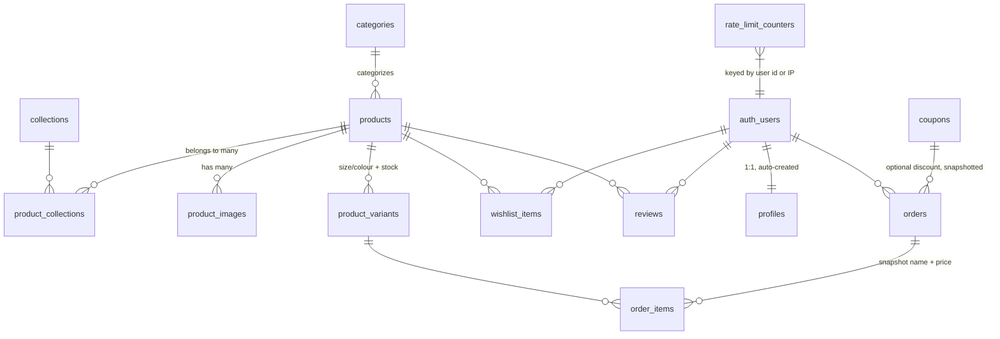

# Database

PostgreSQL via Supabase. Schema is defined across 11 ordered migrations in
[`supabase/migrations/`](../supabase/migrations/), flattened for convenience
into [`supabase/ALL_MIGRATIONS.sql`](../supabase/ALL_MIGRATIONS.sql).

## Entity relationships

## Tables

| Table | Purpose |
|---|---|
| `categories`, `collections`, `product_collections` | Catalog taxonomy — a product belongs to one category and any number of collections |
| `products`, `product_images`, `product_variants` | Catalog data; variants own size/color and per-variant stock |
| `profiles` | 1:1 with `auth.users`, auto-created by trigger on sign-up; `role` is `customer` or `admin` |
| `wishlist_items` | Server-synced wishlist, owner-only RLS |
| `orders`, `order_items` | Orders snapshot `product_name`/`unit_price` at purchase time so history survives later catalog changes |
| `coupons` | Percentage/fixed discounts with expiry, usage limits, minimum order, max discount cap |
| `rate_limit_counters` | Shared sliding-window counter table used by every rate-limited Edge Function (checkout, coupon validation, newsletter) |
| `newsletter_signups` | Insert-only from the public newsletter form |

Two tables are scaffolded but not yet wired to the UI — noted here rather
than glossed over, since an honest schema beats a padded feature list:

- **`cart_items`** exists (in case the cart ever moves server-side for
  cross-device sync), but the cart is currently, deliberately,
  `localStorage`-only — there's no login requirement to shop, and it keeps
  checkout fast with zero extra round-trips.
- **`reviews`** exists (schema + RLS ready) but nothing in the UI reads or
  writes it yet. Listed in [`roadmap.md`](./roadmap.md).

## Key design decisions

- **UUID primary keys** everywhere (`gen_random_uuid()`). `slug` is the
  public identifier for products/categories/collections, so URLs never leak
  internal ids.
- **Variants own inventory**, not products — a product's total stock is the
  sum of its variants (size × color), each tracked independently. Order
  items reference a variant, not just a product.
- **Order-time snapshots.** `order_items.product_name`/`unit_price` and
  `orders.coupon_code`/`discount_type`/`discount_value` are copied at the
  moment of purchase (not live-joined), so an order's receipt never changes
  retroactively if the product is renamed, repriced, or the coupon is later
  edited or deleted.
- **Idempotent stock decrement.** A trigger pair (`stock_decremented` guard
  column + `BEFORE`/`AFTER` triggers) ensures inventory is decremented
  *exactly once* per order even though Stripe's webhook can legitimately
  fire more than once for the same event.
- **Coupon usage counting follows the same idempotent pattern** — a
  `coupon_usage_counted` boolean plus a trigger pair increments
  `coupons.used_count` exactly once on the `payment_status → paid`
  transition.
- **Profiles auto-provision** via a trigger on `auth.users` insert. The RLS
  `UPDATE` policy on `profiles` explicitly excludes the `role` column from
  what a user can change about their own row — you cannot promote yourself
  to admin by editing your profile.

## Row Level Security (RLS)

Every table has RLS enabled — there is no service-role bypass on the
frontend. Summary:

| Table | Read | Write |
|---|---|---|
| Catalog tables | Public, but only `active`/published rows for non-admins | Admin-only (`is_admin()`) |
| `profiles` | Own row only | Own row only, `role` excluded |
| `wishlist_items` | Owner only | Owner only |
| `orders`, `order_items` | Owner sees own; admins see all | Customers create their own `pending` order; only admins update status |
| `coupons` | Admin-only (codes aren't publicly listable — a coupon is only confirmed valid by submitting it) | Admin-only |
| `newsletter_signups` | — | Insert-only, public |
| `rate_limit_counters` | Service-role only (Edge Functions), never exposed to the client |

`is_admin()` is a `security definer` function that checks
`profiles.role = 'admin'` for the calling user — used throughout the
catalog/orders/coupons policies rather than duplicating the check inline
everywhere.

## Storage

Two Supabase Storage buckets: `product-images` (admin-write, public-read)
and `avatars` (each user writes only inside their own `<uid>/` folder,
public-read). The database stores URLs only.

## See also

- [`architecture.md`](./architecture.md) — how the schema fits into the wider system
- [`coupon-flow.md`](./coupon-flow.md), [`inventory-flow.md`](./inventory-flow.md) — the trigger logic above, explained end-to-end
