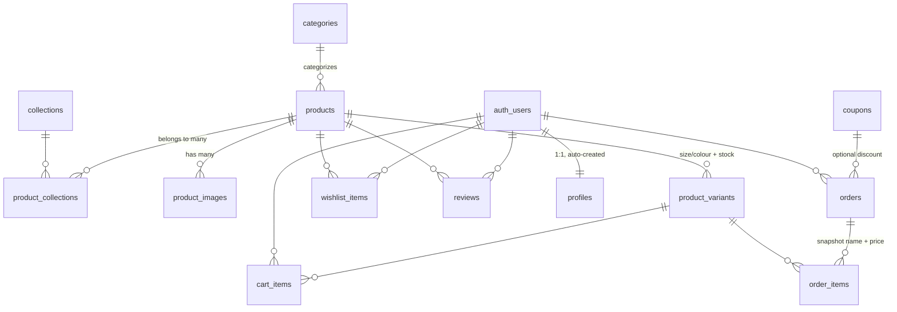

# ACD Fashion — Database Design

Production-ready PostgreSQL schema for the ACD Fashion e-commerce site, built
for Supabase. Designed from an analysis of the actual frontend: product URLs
use slugs, the UI needs a category, sizes, one primary image, a badge, an
edition number, and a release index for sorting — all preserved here.

> For the conceptual schema overview, ERD, and security model in the context
> of the full current application, see [`docs/database.md`](../docs/database.md)
> at the repo root — this file focuses on the migration mechanics.

## How to apply

Open Supabase → **SQL Editor**, paste **`ALL_MIGRATIONS.sql`** (this folder), and
click **Run**. It contains, in order, all 11 migrations:

| File | Contents |
|---|---|
| `migrations/001_schema.sql` | Tables, constraints, indexes, triggers |
| `migrations/002_rls.sql` | Row Level Security policies |
| `migrations/003_storage.sql` | Storage buckets (`product-images`, `avatars`) + policies |
| `migrations/004_seed.sql` | Seed data generated from the live catalog (safe to re-run) |
| `migrations/005_admin.sql` | Admin role support (`profiles.role`, `is_admin()`) |
| `migrations/006_security_hardening.sql` | RLS/policy hardening pass |
| `migrations/007_stripe_payments.sql` | Orders/order_items, Stripe fields, idempotent stock-decrement triggers |
| `migrations/008_paid_at.sql` | `orders.paid_at` timestamp |
| `migrations/009_newsletter_signups.sql` | Newsletter signup table |
| `migrations/010_rate_limiting.sql` | Shared `rate_limit_counters` table + `check_rate_limit()` |
| `migrations/011_coupons.sql` | Coupon fields on orders + idempotent usage-count triggers |

## ERD (entity relationships)

Key decisions:

- **UUID primary keys** everywhere (`gen_random_uuid()`); `slug` is the public
  identifier for products/categories/collections so site URLs never expose ids.
- **Variants own the inventory.** A product's stock is the sum of its variants
  (size × colour), each independently tracked. Cart and order items reference
  variants, not products.
- **Order items snapshot** `product_name` and `unit_price` at purchase time, so
  order history survives later price changes or product deletion.
- **Inventory automation:** a trigger decrements variant stock when an order's
  status transitions to `completed` (clamped at 0).
- **Profiles** are auto-created by a trigger on `auth.users` signup, with
  `role in ('customer','admin')`. The RLS `update` policy prevents users from
  promoting themselves to admin.
- **Timestamps:** every mutable table has `created_at`/`updated_at`, with a
  shared `set_updated_at()` trigger.

## Security model (RLS)

- **Catalog** (products, images, variants, categories, collections): public
  read, but **only `active` products** are visible to non-admins. Admins have
  full CRUD via `is_admin()` (a `security definer` lookup on `profiles.role`).
- **Profiles:** users read/update only their own row; cannot change `role`.
- **Cart & wishlist:** owner-only for all operations.
- **Orders:** users see and create only their own; only admins update status.
  Order items can only be added to the owner's own `pending` orders.
- **Reviews:** public read; write/update/delete own only.
- **Storage:** both buckets are public-read. `product-images` is admin-write;
  `avatars` lets each user write only inside their own `<uid>/` folder.
- Verified separately: the newsletter table remains insert-only for visitors.

## Storage

Buckets `product-images` and `avatars` are created by `003_storage.sql`.
The database stores **URLs only**. The seed uses the site's `/images/*.jpg`
paths so everything works immediately; to move media to Storage, upload the
files from `public/images/` into `product-images` (drag-and-drop in the
dashboard) and update `product_images.url` to the public URLs
(`https://<ref>.supabase.co/storage/v1/object/public/product-images/<file>`).

## Frontend integration

- `src/lib/catalog.ts` fetches products + category + images + variants in one
  query and maps them to the exact `Product` shape the UI already used.
- `src/context/ProductsContext.tsx` renders instantly from the bundled catalog
  and swaps to live data when Supabase responds — zero visual change, and the
  site keeps working even if the database is unreachable.
- RLS does the filtering: the anon key can only ever see active products.
- The cart is intentionally `localStorage`-only, even though full
  authentication now exists — it keeps shopping login-free and checkout
  fast with no extra round-trips. The `cart_items` table exists in the
  schema (unused) for a future cross-device cart; see
  [`docs/roadmap.md`](../docs/roadmap.md).

## Scalability suggestions (future)

Checkout, coupons, and Stripe integration described in earlier drafts of
this file are now fully implemented — see
[`docs/checkout-flow.md`](../docs/checkout-flow.md),
[`docs/stripe-flow.md`](../docs/stripe-flow.md), and
[`docs/coupon-flow.md`](../docs/coupon-flow.md). Remaining ideas:

1. **Reviews:** the `reviews` table + RLS policies already exist; nothing in
   the UI reads or writes them yet.
2. **Search:** add `pg_trgm` + a GIN index on `products.name` for fuzzy search
   once the catalog grows past a few hundred items; paginate with
   `range()` instead of loading the full catalog.
3. **Ratings:** maintain `products.rating_avg`/`rating_count` via trigger on
   `reviews` to avoid aggregate queries per page load.
4. **Auth-linked cart:** on login, merge the localStorage cart into
   `cart_items`; keep the anonymous cart for guests.
5. **Guest checkout** is already supported (`orders.user_id` nullable +
   `email`), but needs an RLS-exempt path (Edge Function with service role).
6. **Images:** use Supabase's image transformations (`?width=600`) for
   responsive srcsets; store originals in `product-images`.
7. **Ops:** partition `orders` by month if volume grows large; point-in-time
   recovery and read replicas are available on paid Supabase tiers.
